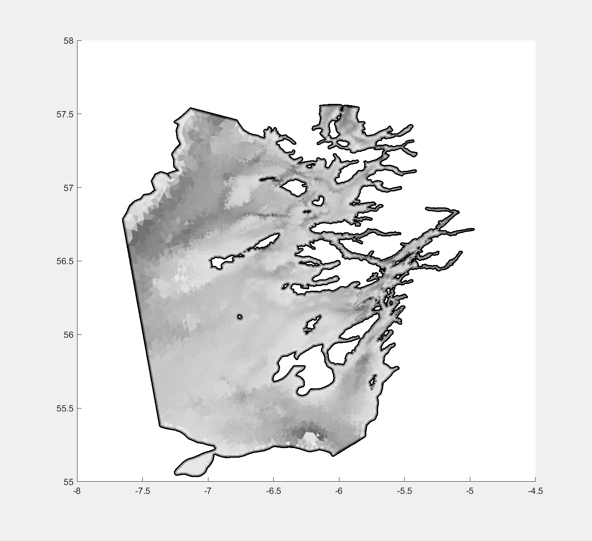
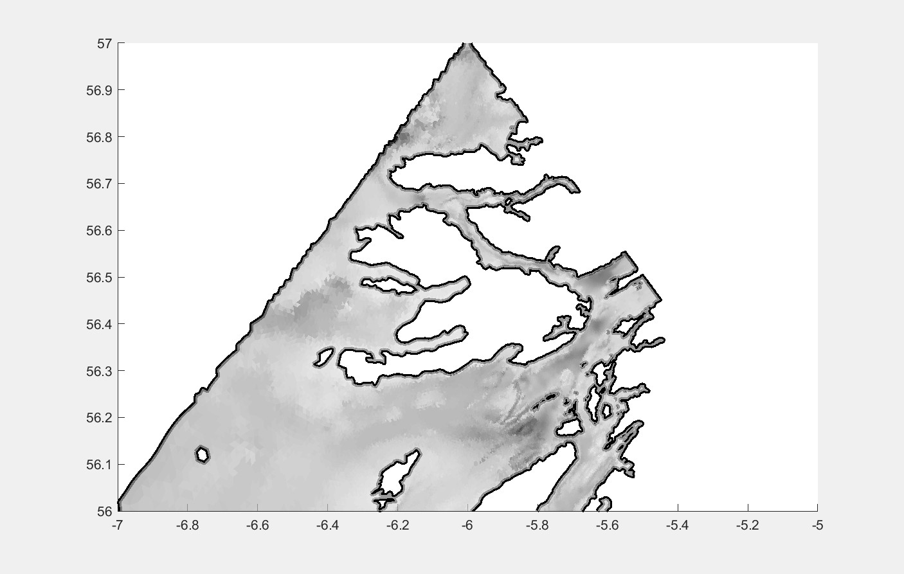
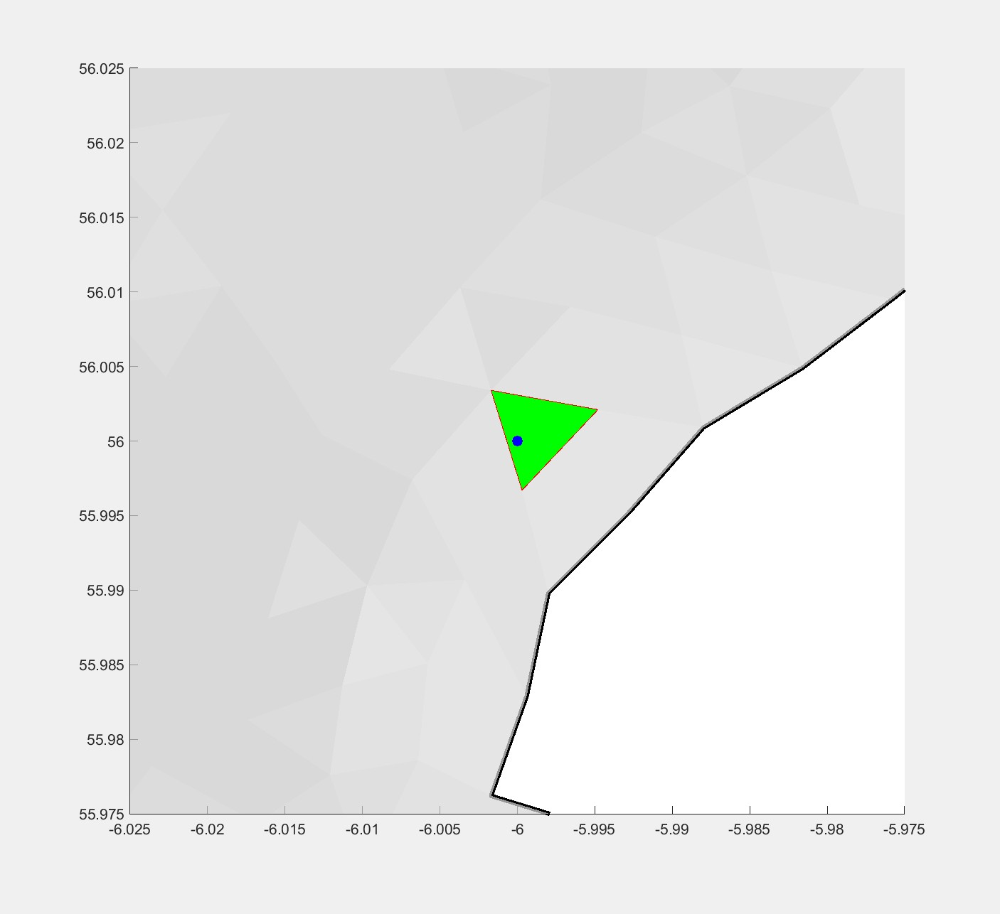
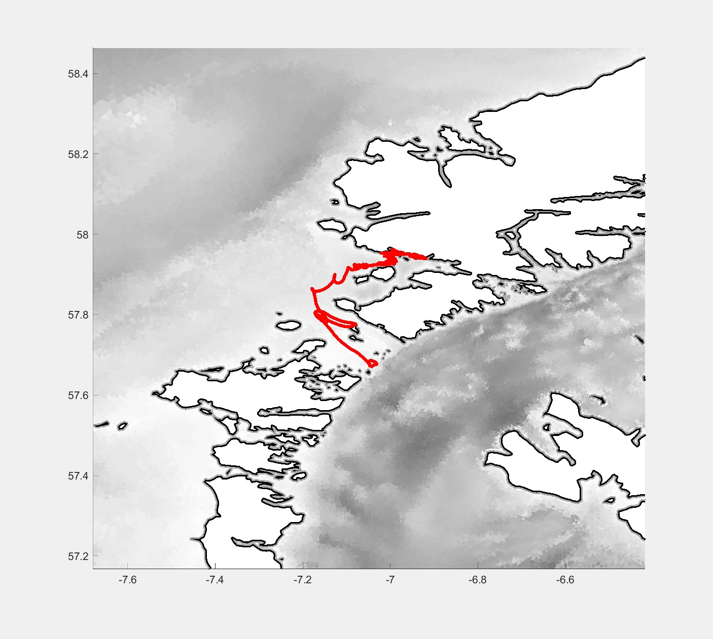
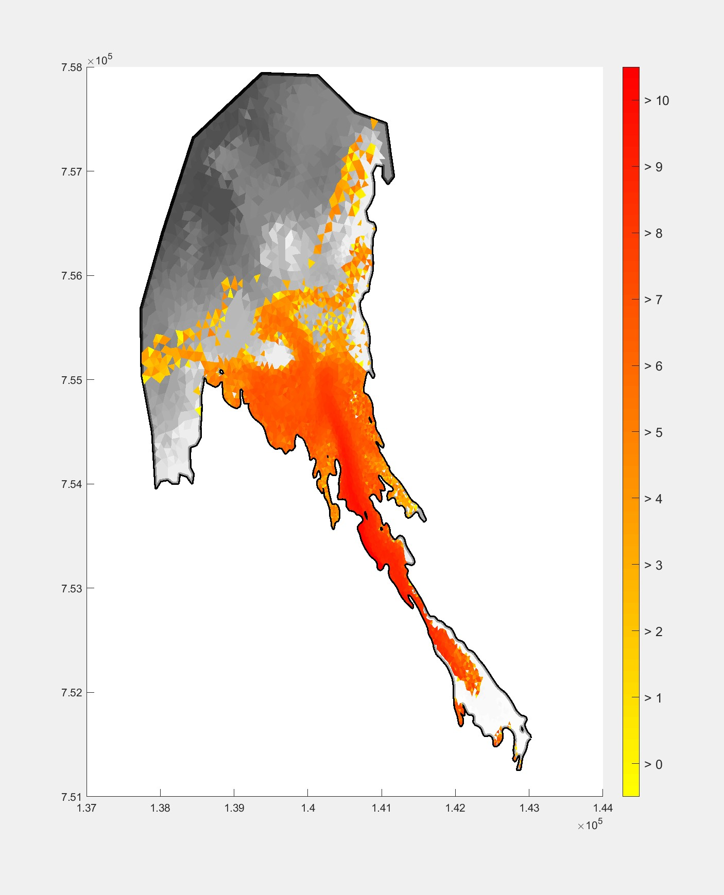
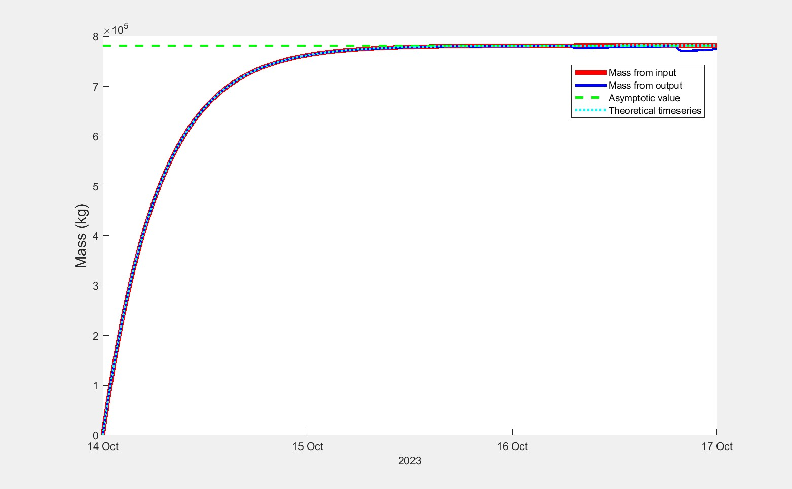

# Mike toolbox - Interface for DHIs DHIMatlabToolbox-v19.0.0-20201217

## Introduction

This toolbox provides a series of wrapper functions for DHI's tools for processing Mike model files. The DHI toolbox is no longer supported; MikeIO available here https://github.com/DHI/mikeio is the active repository for use in Python. If/when we move to python, this Mike toolbox will be obsolete.

The files in this toolbox are listed below with a brief description. More information is contained later in this document and in the individual files' help.

|File|Description|
|-|-|
|`cropMesh.m`                | Crop mesh struct based on indices, axis or polyshape
|`dfsuHD2mat.m`              | Convert dfsu file to matfile !!! TO FIX !!!
|`loadMesh.m`                | Load .mesh file into struct
|`logInfo.m`                 | Load .log file and determine infomation about Mike model run 
|`massPerTimeStep.m`         | Calculate mass per timestep used in particle tracking runs
|`mesh2MeshStruct.m`         | Generate additional fields for Mike mesh such as cell areas, polyshape of boundary etc
|`meshIndex.m`               | Determine index of grid containing coordinates. Works for both triangular & rectilinear grids (Not tested for mixture of the two though!) 
|`mfm2struct.m`              | Generate struct containing information about model run (from input e.g. .m21fm file)
|`mfmStruct2Text.m` 		   | Generate text from struct created by mfm2struct function. This can be used to generate e.g new mfm21 file
|`mike2MIKE.m` 			   | Convert struct loaded by Mike from dfs0/dfsu file to format loaded by MIKE (for backward compatability)
|`mikeNullValue.mat`         |  1.00000001800251e-35 - value used by Mike to indicate empty value
|`modelMassFromInputFiles.m` | Particle Tracking - calculate total mass in model domain based on input files
|`modelMassFromOutputFiles.m`| Particle Tracking - calculate total mass in model domain based on dfsu files
|`nan2null.m`                | convert nan values to Mike's null value in mikeNullValue.mat
|`null2nan.m`                | convert Mike's null value in mikeNullValue.mat to nan
|`nullVal.m`                 | returns value in mikeNullValue.mat
|`plot.m`                    | Plot mesh, points, concentration. Interactive and displays info in status bar NB warning that it will break in future release though due to java issue
|`readDfsFile.m`            | Wrapper function for read files below. 
|`readDfs0File.m`            | Read .dfs0 file. 
|`readDfsuFile.m`           | Read .dfsu file - options for filtering timesteps/indices/fields to be loaded 
|`sourceInfo.m`              | Extract key information about sources included in particle tracking
|`sussed2Total.m`            | Calculate total mass (µg) in cell from suspended and sedimented contributions

## Additional information

These files are used for various aspects of modelling. More information on these is presented in the subsections below.

### Mesh

#### `loadMesh`

`meshStruct=Mike.loadMesh(meshFile)` loads a .mesh file and returns a struct with key information about the model domain. By default, it calls `meshBoundary` to get the boundary coordinates of the domain.

```  
      meshIndices: [217417×3 double]
              xMesh: [115583×1 double]
              yMesh: [115583×1 double]
              zMesh: [115583×1 double]
              codes: [115583×1 double]
               proj: 'LONG/LAT'
              zunit: 1000
              nodes: [115583×4 double]
    boundaryIndices: [14169×1 double]
      xMeshBoundary: [14169×1 double]
      yMeshBoundary: [14169×1 double]   
```	  
This can be plotted using:
`Mike.plot(meshStruct)`



#### `cropMesh`

The mesh can be cropped to smaller size if required using `cropMesh`. This function retains cells with any vertex within the specified polyshape / axis passed as the second argument. Alternatively, the cells to be retained can by specified by passing an array of logical values, one per cell. 

	```
	ps=polyshape(-[5,6,7],[56,57,56]);
	croppedMesh=Mike.cropMesh(meshStruct,ps)
	Mike.plot(croppedMesh)




#### `mesh2MeshStruct`

This generates additional information about the mesh and saves to a matfile for faster access. In particular, it creates easting/northing fields and calculates the area of each cell.

#### `meshIndex`

This finds the grid cell containing input coordinates.

```
x=-6;
y=56;
ind=Mike.meshIndex(x,y,meshStruct);
faces=meshStruct.meshIndices(ind,:);
vertices=[meshStruct.xMesh,meshStruct.yMesh,meshStruct.zMesh*0];

Mike.plot(meshStruct)
patch('faces',faces,'vertices',vertices,'facecolor','g','edgecolor','r')
ax=boundaryRectangle(x,y,'dx',0.05,'axis',1);
scatter(x,y,50,'b','filled')
axis(ax) 
```



### Input files

Definition files (e.g. `.m21fm`) can be loaded into a struct to allow input settings to be inspected:

 ```
  mfmStruct=Mike.mfm2struct(m21fmFile)
  
                      FileName: 'C:\MIKEZeroProjectsSEPA\Dervaig\Model\test_ptinput2_tedtest.m21fm'
                  EngineName: 'FemEngineHD'
                      DOMAIN: [1×1 struct]
                        TIME: [1×1 struct]
            MODULE_SELECTION: [1×1 struct]
         HYDRODYNAMIC_MODULE: [1×1 struct]
            TRANSPORT_MODULE: [1×1 struct]
               ECOLAB_MODULE: [1×1 struct]
        MUD_TRANSPORT_MODULE: [1×1 struct]
       SAND_TRANSPORT_MODULE: [1×1 struct]
    PARTICLE_TRACKING_MODULE: [1×1 struct]
                      header: {4×1 cell}
               evalcCommands: {4820×1 cell}
  
  ```

#### Sources for particle tracking
The struct generated by `mfm2struct` can be further processed to extract sources used in particle tracking:

```
>> Mike.sourceInfo(mfmStruct)
```
|Name |coordinates |ClassIndex |number_of_particles_per_timestep |particleMass |perParticle |asFlux |dfs0File |decay |timeStep |
|-|-|-|-|-|-|-|-|-|-|
| {'kg_total'}| 140000 755500 -0.01| 1| 13| 3.14| 0| 0| {0×0 char}| 0| 30|
| {'kg_perparticle'}| 140000 755500 -0.01| 2| 13| 3.14| 1| 0| {0×0 char}| 0| 30|
| {'flux_total'}| 140000 755500 -0.01| 3| 13| 3.14| 0| 1| {0×0 char}| 0| 30|
| {'flux_perparticle'}| 140000 755500 -0.01| 4| 13| 3.14| 1| 1| {0×0 char}| 0| 30|

#### Modification of input files
NB this is in development! For m21fm files defining a particle tracking run, the source can be changed and a new .m21fm generated. This could potentially speed up the production of additional model runs.

```
mfmStructChar=Mike.mfm2struct(m21fmFile,0); % Extract settings as chars (no conversion to numeric)
newm=mfmStructChar;
% New source settings:
sourceName='''FishFace''';
x0=139400;
y0=756400;
depth=-0.01;
pos=[x0,y0,depth];
% Update source settings in struct (Need to change source/class name):
newm.PARTICLE_TRACKING_MODULE.CLASSES.CLASS_1.name=sourceName;
newm.PARTICLE_TRACKING_MODULE.SOURCES.SOURCE_1.Name=sourceName;
newm.PARTICLE_TRACKING_MODULE.SOURCES.SOURCE_1.coordinates=pos; 
% Convert struct to text:
txt=Mike.mfmStruct2Text(newm);
% Write new .m21fm file:
f= 'C:\MIKEZeroProjectsSEPA\matlabNewSource.m21fm';
writeTxtFile(f,txt)
```
Further  testing required...

### Output files

#### `logInfo`

Pass this function a `.log` file, or a folder containing a single `.log` file, and it reads it in an provides information about the model run such as whether it completed successfully and how long it took. 

#### `readDfs0File`

`dfs0Data=Mike.readDfs0File(dfs0File)` returns a struct with `metaData` and `data` fields. The data for each parameter is stored in a separate struct in `data`.

The old version of this toolbox, `+MIKE`, stored the data differently.  For backward compatability, the previous format can be regenerated:

```
new=Mike.readDfs0File(dfs0File);
old=MIKE.readDfs0File(dfs0File);
isequal(new,old) % 0
redo=Mike.mike2MIKE(new); % Convert to old format
isequal(redo,old) % 1
```

An example of extracting and plotting data is shown below:

```
dfs0DataNaN=Mike.null2nan(dfs0Data); % Replace Mike's nullVal with nan (so they aren't plotted)
items=dfs0DataNaN.metaData.items; % Parameters stored in dfs0 filie
x=dfs0DataNaN.data(strcmp(items,'x')).value; % x coordinate
y=dfs0DataNaN.data(strcmp(items,'y')).value; % y coordinate
meshStruct=meshStructs.ECLH;
Mike.plot(meshStruct,'close',1)
plot(x,y,'-r','linewidth',3)
ax=boundaryRectangle(x,y,'dx',0.5,'axis',1);
axis(ax)
```



#### `readDfsuFile`

Unstructured model output in `.dfsu` files can be loaded using:

`dfsuData=Mike.readDfsuFile(dfsuFile)`

NB these files can be very large in which case this function is slow and may even cause matlab to run out of memory. There are various options for filtering the data extracted (spatially, temporally and by parameter)- see help for detail. 

An example plot of a `dfsu` file containing concentration data is shown below:

```
%% Plot last timestep
conc=dfsuData.suspended0x2CAlltBhacainMass;
data=conc(:,end);
data=log10(data);
data(isinf(data))=nan;
colourRange=[0,10];
Mike.plot(meshStruct,'data',data,'close',1,'colourRange',colourRange)
```



#### `readDfsFile`

Wrapper function - pass either `dfs0` or `dfsu` file(s) and this will call relevant function above. 

### Mass Balance

Useful to check mass balance to ensure particles accounted for, particularly if we are scaling concentrations to represent real substances. 

The mass added to the model can be calculated using `modelMassFromInputFiles` which determines the mass timeseries based on model settings (and dfs0 file if applicable).

The mass present in the model output can be determined from the `dfsu` output file. Function `sussed2Total` combines the suspended (µg/m3) and sedimented (g/m2) concentrations to get total mass in each grid cell (µg) as a function of time. 

An example assessment is shown below:

```
% Mass from input (m21fm) file:
massStructFromInput=Mike.modelMassFromInputFiles(mfmStruct);
% Mass from output (dfsu) file:
massStructFromOutput=Mike.modelMassFromOutputFiles(dfsuTotal,meshStruct);

% Theoretical mass (asymptotic value = M/k where M is constant mass added per second
% and k = decay rate (per second)
sourceInfo=Mike.sourceInfo(mfmStruct);
M=Mike.massPerTimeStep(sourceInfo)/sourceInfo.timeStep; % mass per second:
k=sourceInfo.decay;
asymptoticValue=M/k;

% Theoretical timeseries:
% This is calculated using convolution function, which works for non-uniform M. 
% Use HD timings (30s) rather than dfsu timings (15 minutes) for greater accuracy. (Using
% 15 minutes results in overprediction due to discrete nature of conv function 
% - intermediate decay is neglected)
t=massStructFromInput.dateTime;
t=(t-t(1))*24*60*60; % Time in seconds from start
dt=unique(round(diff(t))); % Time spacing (30s)
theoreticalTimeSeries=conv(repmat(M*dt,size(t)),exp(-k*t));
% Crop conv output and offset by adding zero to start:
theoreticalTimeSeries=[0;theoreticalTimeSeries(1:length(t)-1)];

% Plot
prepareFigure('close',0,'ylabel','Mass (kg)')
h1=plot(massStructFromInput.dateTime,massStructFromInput.mass,'-r','linewidth',4,'displayname','Mass from input');
h2=plot(massStructFromOutput.dateTime,massStructFromOutput.mass,'-b','linewidth',2,'displayname','Mass from output');
h3=plot(xlim,asymptoticValue*[1,1],'--g','linewidth',2,'displayname','Asymptotic value');
t=massStructFromInput.dateTime;
h4=plot(t,theoreticalTimeSeries,':c','linewidth',2,'displayname','Theoretical timeseries');
h=[h1,h2,h3,h4];
legend(h)

t0=min(massStructFromInput.dateTime);
xlim(t0+[0,3])
datetimeAxis
```

